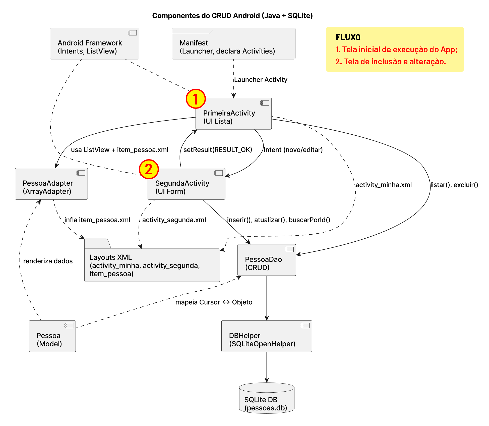

# Atividade avaliativa: CRUD Android (Java + SQLite)

Este é a versão inicial de um aplicativo Android, **esqueleto já criado** (sem nenhuma Activity), e que deverá ser utilizado por cada aluno da disciplina como base para a realização da atividade avaliativa. Para isso, deve-se  **criar um *fork* deste repositório** e continuar o desenvolvimento conforme as orientações abaixo.

## Objetivo da atividade
Desenvolver um aplicativo Android (Legado) que permita:
- Incluir pessoa
- Listar pessoas
- Editar pessoa
- Excluir pessoa

### Layout das telas
### 

### Arquitetura do aplicativo
### 

## Orientações gerais

Cada aluno, individualmente, deverá continuar o desenvolvimento do aplicativo Android **com arquitetura legada**, em **Java**, que implementa um CRUD (Create, Read, Update, Delete) simples para gerenciar a lista de pessoas usando o banco de dados SQLite. O aplicativo deverá ser desenvolvido  seguindo o passo a passo deste tutorial e apresentado até o dia da avaliação somativa N2 rodando no emulador ou em um smartphone Android.

## `Atenção!!!`
`Só serão considerados válidos os projetos que seguirem estritamente as orientações e etapas de versionamento de códigos especificadas neste repositório.`

---

# Versionamento de código

O projeto a ser desenvolvido deverá ser versionado, `obrigatoriamente`, em um **Fork** deste repositório e deverá ter os seguintes commits após cada etapa:

1. Criação da PrimeiraActivity
2. Criação da SegundaActivity
3. Layout final da PrimeiraActivity
4. Layout final da SegundaActivity
5. Layout do item da lista
6. Criação da classe Pessoa.java
7. Criação da classe DBHelper.java
8. Criação da classe PessoaDao.java
9. Criação da classe PessoaAdapter.java
10. Versão final da PrimeiraActivity
11. Versão final da SegundaActivity
12. Versão final do Manifest

---

## Como fazer *fork* do repositório (GitLab)

1. Acesse a página do repositório **original** no GitLab.  
2. Clique em **Fork** (no topo à direita).  
3. Escolha o **namespace** (sua conta/grupo) e confirme em **Fork project**.  

---

# Fluxo de desenvolvimento
### 

---

## 1) Projeto inicial (sem Activity)

- **Nome do app (ex.):** `AppCrudLegado` 
- **Package name:** `br.pucpr`  
- **Language:** Java  
---

## 2) Crie os pacotes
```
br.pucpr
 ├─ ui
 ├─ model
 ├─ db
 └─ adapter
```

---

## 3) Crie a PrimeiraActivity e execute o aplicativo no emulador
```java
package br.pucpr.ui;

import android.os.Bundle;
import androidx.appcompat.app.AppCompatActivity;
import br.pucpr.R;

public class PrimeiraActivity extends AppCompatActivity {
    @Override
    protected void onCreate(Bundle savedInstanceState) {
        super.onCreate(savedInstanceState);
        setContentView(R.layout.activity_primeira);
        setTitle("PrimeiraActivity");
    }
}
```

**Layout provisório:** `activity_primeira.xml`
```xml
<FrameLayout xmlns:android="http://schemas.android.com/apk/res/android"
    android:layout_width="match_parent"
    android:layout_height="match_parent"
    android:layout_marginTop="120dp">

    <TextView
        android:text="PrimeiraActivity (provisório)"
        android:layout_width="wrap_content"
        android:layout_height="wrap_content"
        android:layout_gravity="center"/>
</FrameLayout>
```

Manifest:
```xml
<activity android:name=".ui.PrimeiraActivity">
    <intent-filter>
        <action android:name="android.intent.action.MAIN"/>
        <category android:name="android.intent.category.LAUNCHER"/>
    </intent-filter>
</activity>
```
`Commit obrigatório:`
```
  git add .
  git commit -m "Criação da PrimeiraActivity"
  git push
```
---

## 4) Crie a SegundaActivity e execute o aplicativo no emulador
```java
package br.pucpr.ui;

import android.os.Bundle;
import androidx.appcompat.app.AppCompatActivity;
import br.pucpr.R;

public class SegundaActivity extends AppCompatActivity {
    @Override
    protected void onCreate(Bundle savedInstanceState) {
        super.onCreate(savedInstanceState);
        setContentView(R.layout.activity_segunda);
        setTitle("SegundaActivity");
    }
}
```

**Layout provisório:** `activity_segunda.xml`
```xml
<FrameLayout xmlns:android="http://schemas.android.com/apk/res/android"
    android:layout_width="match_parent"
    android:layout_height="match_parent"
    android:layout_marginTop="120dp">

    <TextView
        android:text="SegundaActivity (provisório)"
        android:layout_width="wrap_content"
        android:layout_height="wrap_content"
        android:layout_gravity="center"/>
</FrameLayout>
```
`Commit obrigatório:`
```
  git add .
  git commit -m "Criação da SegundaActivity"
  git push
```
---

## 5) Aplique o layout final da PrimeiraActivity
```xml
<LinearLayout xmlns:android="http://schemas.android.com/apk/res/android"
    android:orientation="vertical"
    android:padding="12dp"
    android:layout_width="match_parent"
    android:layout_height="match_parent"
    android:layout_marginTop="120dp">

    <Button
        android:id="@+id/btnAdicionar"
        android:layout_width="match_parent"
        android:layout_height="wrap_content"
        android:text="Adicionar Pessoa"/>

    <ListView
        android:id="@+id/listPessoas"
        android:layout_width="match_parent"
        android:layout_height="0dp"
        android:layout_weight="1"
        android:divider="@android:color/darker_gray"
        android:dividerHeight="0.5dp"/>
</LinearLayout>
```
`Commit obrigatório:`
```
  git add .
  git commit -m "Layout final da PrimeiraActivity"
  git push
```
---

## 6) Aplique o layout final da SegundaActivity
```xml
<LinearLayout xmlns:android="http://schemas.android.com/apk/res/android"
    android:orientation="vertical"
    android:padding="16dp"
    android:layout_width="match_parent"
    android:layout_height="match_parent"
    android:layout_marginTop="120dp">

    <EditText
        android:id="@+id/etNome"
        android:layout_width="match_parent"
        android:layout_height="wrap_content"
        android:hint="Nome"
        android:inputType="textPersonName"/>

    <EditText
        android:id="@+id/etEmail"
        android:layout_width="match_parent"
        android:layout_height="wrap_content"
        android:hint="Email"
        android:inputType="textEmailAddress"
        android:layout_marginTop="8dp"/>

    <LinearLayout
        android:orientation="horizontal"
        android:layout_width="match_parent"
        android:layout_height="wrap_content"
        android:gravity="end"
        android:layout_marginTop="16dp">

        <Button
            android:id="@+id/btnCancelar"
            android:layout_width="wrap_content"
            android:layout_height="wrap_content"
            android:text="Cancelar"/>

        <Button
            android:id="@+id/btnSalvar"
            android:layout_width="wrap_content"
            android:layout_height="wrap_content"
            android:text="Salvar"
            android:layout_marginStart="12dp"/>
    </LinearLayout>

</LinearLayout>
```
`Commit obrigatório:`
```
  git add .
  git commit -m "Layout final da SegundaActivity"
  git push
```
---

## 7) Crie, aplique o layout do item da lista e execute o aplicativo no emulador

**Layout:** `item_pessoa.xml`
```xml
<LinearLayout xmlns:android="http://schemas.android.com/apk/res/android"
    android:padding="12dp"
    android:orientation="vertical"
    android:layout_width="match_parent"
    android:layout_height="wrap_content">

    <TextView
        android:id="@+id/txtNome"
        android:layout_width="match_parent"
        android:layout_height="wrap_content"
        android:text="Nome"
        android:textStyle="bold"
        android:textSize="16sp"/>

    <TextView
        android:id="@+id/txtEmail"
        android:layout_width="match_parent"
        android:layout_height="wrap_content"
        android:text="email@example.com"
        android:textColor="#666666"/>
</LinearLayout>
```
`Commit obrigatório:`
```
  git add .
  git commit -m "Layout do item da lista"
  git push
```
---

## 8) Crie e aplique o código da classe Pessoa.java
```java
package br.pucpr.app.model;

public class Pessoa {
    private long id;
    private String nome;
    private String email;

    public Pessoa() {}

    public Pessoa(long id, String nome, String email) {
        this.id = id;
        this.nome = nome;
        this.email = email;
    }

    public long getId() { return id; }
    public void setId(long id) { this.id = id; }

    public String getNome() { return nome; }
    public void setNome(String nome) { this.nome = nome; }

    public String getEmail() { return email; }
    public void setEmail(String email) { this.email = email; }
}
```
`Commit obrigatório:`
```
  git add .
  git commit -m "Criação da classe Pessoa.java"
  git push
```
---

## 9) Crie e aplique o código da classe DBHelper.java
```java
package br.pucpr.db;

import android.content.Context;
import android.database.sqlite.SQLiteDatabase;
import android.database.sqlite.SQLiteOpenHelper;

public class DBHelper extends SQLiteOpenHelper {
    public static final String DB_NAME = "pessoas.db";
    public static final int DB_VERSION = 1;
    public static final String TABELA_PESSOA = "pessoa";
    public static final String COL_ID = "_id";
    public static final String COL_NOME = "nome";
    public static final String COL_EMAIL = "email";

    public DBHelper(Context ctx) { super(ctx, DB_NAME, null, DB_VERSION); }

    @Override
    public void onCreate(SQLiteDatabase db) {
        String ddl = "CREATE TABLE " + TABELA_PESSOA + " (" +
                COL_ID + " INTEGER PRIMARY KEY AUTOINCREMENT, " +
                COL_NOME + " TEXT NOT NULL, " +
                COL_EMAIL + " TEXT NOT NULL)";
        db.execSQL(ddl);
    }
    @Override
    public void onUpgrade(SQLiteDatabase db, int oldV, int newV) {
        db.execSQL("DROP TABLE IF EXISTS " + TABELA_PESSOA);
        onCreate(db);
    }
}
```
`Commit obrigatório:`
```
  git add .
  git commit -m "Criação da classe DBHelper.java"
  git push
```
---

## 10) Crie e aplique o código da classe PessoaDao.java
```java
package br.pucpr.app.db;

import android.content.ContentValues;
import android.content.Context;
import android.database.Cursor;
import android.database.sqlite.SQLiteDatabase;

import java.util.ArrayList;
import java.util.List;

import br.pucpr.app.model.Pessoa;

public class PessoaDao {

    private final DBHelper helper;

    public PessoaDao(Context context) {
        this.helper = new DBHelper(context.getApplicationContext());
    }

    public long inserir(Pessoa p) {
        SQLiteDatabase db = helper.getWritableDatabase();
        try {
            ContentValues cv = new ContentValues();
            cv.put(DBHelper.COL_NOME, p.getNome());
            cv.put(DBHelper.COL_EMAIL, p.getEmail());
            return db.insertOrThrow(DBHelper.TABELA_PESSOA, null, cv);
        } finally {
            db.close();
        }
    }

    public int atualizar(Pessoa p) {
        SQLiteDatabase db = helper.getWritableDatabase();
        try {
            ContentValues cv = new ContentValues();
            cv.put(DBHelper.COL_NOME, p.getNome());
            cv.put(DBHelper.COL_EMAIL, p.getEmail());
            String where = DBHelper.COL_ID + " = ?";
            String[] args = { String.valueOf(p.getId()) };
            return db.update(DBHelper.TABELA_PESSOA, cv, where, args);
        } finally {
            db.close();
        }
    }

    public int excluir(long id) {
        SQLiteDatabase db = helper.getWritableDatabase();
        try {
            String where = DBHelper.COL_ID + " = ?";
            String[] args = { String.valueOf(id) };
            return db.delete(DBHelper.TABELA_PESSOA, where, args);
        } finally {
            db.close();
        }
    }

    public Pessoa buscarPorId(long id) {
        SQLiteDatabase db = helper.getReadableDatabase();
        Cursor c = null;
        try {
            c = db.query(
                    DBHelper.TABELA_PESSOA,
                    new String[]{DBHelper.COL_ID, DBHelper.COL_NOME, DBHelper.COL_EMAIL},
                    DBHelper.COL_ID + " = ?",
                    new String[]{ String.valueOf(id) },
                    null, null, null
            );
            if (c.moveToFirst()) {
                Pessoa p = new Pessoa();
                p.setId(c.getLong(0));
                p.setNome(c.getString(1));
                p.setEmail(c.getString(2));
                return p;
            }
            return null;
        } finally {
            if (c != null) c.close();
            db.close();
        }
    }

    public List<Pessoa> listarTudo() {
        SQLiteDatabase db = helper.getReadableDatabase();
        Cursor c = null;
        List<Pessoa> lista = new ArrayList<>();
        try {
            c = db.query(
                    DBHelper.TABELA_PESSOA,
                    new String[]{DBHelper.COL_ID, DBHelper.COL_NOME, DBHelper.COL_EMAIL},
                    null, null, null, null,
                    DBHelper.COL_NOME + " COLLATE NOCASE ASC"
            );
            while (c.moveToNext()) {
                Pessoa p = new Pessoa();
                p.setId(c.getLong(0));
                p.setNome(c.getString(1));
                p.setEmail(c.getString(2));
                lista.add(p);
            }
            return lista;
        } finally {
            if (c != null) c.close();
            db.close();
        }
    }
}
```

`Commit obrigatório:`
```
  git add .
  git commit -m "Criação da classe PessoaDao.java"
  git push
```
---

## 11) Crie e aplique o código da classe PessoaAdapter.java
```java
package br.pucpr.app.adapter;

import android.content.Context;
import android.view.LayoutInflater;
import android.view.View;
import android.view.ViewGroup;
import android.widget.ArrayAdapter;
import android.widget.TextView;

import java.util.List;

import br.pucpr.app.R;
import br.pucpr.app.model.Pessoa;

public class PessoaAdapter extends ArrayAdapter<Pessoa> {
    private final LayoutInflater inflater;

    public PessoaAdapter(Context context, List<Pessoa> data) {
        super(context, 0, data);
        this.inflater = LayoutInflater.from(context);
    }

    static class ViewHolder {
        TextView txtNome;
        TextView txtEmail;
    }

    @Override
    public View getView(int position, View convertView, ViewGroup parent) {
        View v = convertView;
        ViewHolder h;

        if (v == null) {
            v = inflater.inflate(R.layout.item_pessoa, parent, false);
            h = new ViewHolder();
            h.txtNome = v.findViewById(R.id.txtNome);
            h.txtEmail = v.findViewById(R.id.txtEmail);
            v.setTag(h);
        } else {
            h = (ViewHolder) v.getTag();
        }

        Pessoa p = getItem(position);
        if (p != null) {
            h.txtNome.setText(p.getNome());
            h.txtEmail.setText(p.getEmail());
        }
        return v;
    }
}
```

`Commit obrigatório:`
```
  git add .
  git commit -m "Criação da classe PessoaAdapter.java"
  git push
```
---

## 12) Aplique o código final da PrimeiraActivity
- Lista pessoas usando `PessoaAdapter`
- Botão "Adicionar" → abre `SegundaActivity`
- Toque curto → editar  
- Toque longo → excluir 

```java
package br.pucpr.app.ui;

import android.app.AlertDialog;
import android.content.DialogInterface;
import android.content.Intent;
import android.os.Bundle;
import android.view.View;
import android.widget.AdapterView;
import android.widget.Button;
import android.widget.ListView;
import android.widget.Toast;

import androidx.appcompat.app.AppCompatActivity;

import java.util.ArrayList;
import java.util.List;

import br.pucpr.app.R;
import br.pucpr.app.adapter.PessoaAdapter;
import br.pucpr.app.db.PessoaDao;
import br.pucpr.app.model.Pessoa;

public class PrimeiraActivity extends AppCompatActivity {

    private static final int REQ_NOVA = 1;
    private static final int REQ_EDITAR = 2;

    private PessoaDao dao;
    private PessoaAdapter adapter;
    private List<Pessoa> dados;

    @Override
    protected void onCreate(Bundle savedInstanceState) {
        super.onCreate(savedInstanceState);
        setContentView(R.layout.activity_primeira);

        setTitle("Pessoas");

        dao = new PessoaDao(this);
        dados = new ArrayList<Pessoa>(dao.listarTudo());
        adapter = new PessoaAdapter(this, (ArrayList<Pessoa>) dados);

        ListView list = findViewById(R.id.listPessoas);
        list.setAdapter(adapter);

        Button btnAdicionar = findViewById(R.id.btnAdicionar);
        btnAdicionar.setOnClickListener(new View.OnClickListener() {
            @Override
            public void onClick(View v) {
                Intent it = new Intent(PrimeiraActivity.this, SegundaActivity.class);
                // Sem id => inclusão
                startActivityForResult(it, REQ_NOVA);
            }
        });

        list.setOnItemClickListener(new AdapterView.OnItemClickListener() {
            @Override
            public void onItemClick(AdapterView<?> parent, View view, int position, long id) {
                Pessoa p = adapter.getItem(position);
                if (p != null) {
                    Intent it = new Intent(PrimeiraActivity.this, SegundaActivity.class);
                    it.putExtra("pessoaId", p.getId());
                    startActivityForResult(it, REQ_EDITAR);
                }
            }
        });

        list.setOnItemLongClickListener(new AdapterView.OnItemLongClickListener() {
            @Override
            public boolean onItemLongClick(AdapterView<?> parent, View view, int position, long id) {
                final Pessoa p = adapter.getItem(position);
                if (p == null) return true;

                new AlertDialog.Builder(PrimeiraActivity.this)
                        .setTitle("Excluir")
                        .setMessage("Deseja excluir " + p.getNome() + "?")
                        .setPositiveButton("Excluir", new DialogInterface.OnClickListener() {
                            @Override
                            public void onClick(DialogInterface dialog, int which) {
                                int linhas = dao.excluir(p.getId());
                                if (linhas > 0) {
                                    Toast.makeText(PrimeiraActivity.this, "Excluído", Toast.LENGTH_SHORT).show();
                                    recarregar();
                                } else {
                                    Toast.makeText(PrimeiraActivity.this, "Falha ao excluir", Toast.LENGTH_SHORT).show();
                                }
                            }
                        })
                        .setNegativeButton("Cancelar", null)
                        .show();
                return true; // consumiu o clique longo
            }
        });
    }

    private void recarregar() {
        List<Pessoa> lista = dao.listarTudo();
        adapter.clear();
        adapter.addAll(lista);
        adapter.notifyDataSetChanged();
    }

    @Override
    protected void onActivityResult(int requestCode, int resultCode, Intent data) {
        super.onActivityResult(requestCode, resultCode, data);
        if (resultCode == RESULT_OK && (requestCode == REQ_NOVA || requestCode == REQ_EDITAR)) {
            recarregar();
        }
    }
}
```

`Commit obrigatório:`
```
  git add .
  git commit -m "Versão final da PrimeiraActivity"
  git push
```
---

## 13) Aplique o código final da SegundaActivity
- Se recebeu `pessoaId`, edita; caso contrário, insere  
- Botões "Salvar" e "Cancelar"  
- Validação de campos  

```java
package br.pucpr.app.ui;

import android.os.Bundle;
import android.text.TextUtils;
import android.view.View;
import android.widget.Button;
import android.widget.EditText;
import android.widget.Toast;

import androidx.appcompat.app.AppCompatActivity;

import br.pucpr.app.R;
import br.pucpr.app.db.PessoaDao;
import br.pucpr.app.model.Pessoa;

public class SegundaActivity extends AppCompatActivity {

    private EditText etNome, etEmail;
    private Button btnSalvar, btnCancelar;

    private PessoaDao dao;
    private long pessoaId = -1L; // -1 => inclusão

    @Override
    protected void onCreate(Bundle savedInstanceState) {
        super.onCreate(savedInstanceState);
        setContentView(R.layout.activity_segunda);

        setTitle("Cadastro de Pessoa");

        dao = new PessoaDao(this);

        etNome = findViewById(R.id.etNome);
        etEmail = findViewById(R.id.etEmail);
        btnSalvar = findViewById(R.id.btnSalvar);
        btnCancelar = findViewById(R.id.btnCancelar);

        if (getIntent() != null && getIntent().hasExtra("pessoaId")) {
            pessoaId = getIntent().getLongExtra("pessoaId", -1L);
            if (pessoaId > 0) {
                Pessoa p = dao.buscarPorId(pessoaId);
                if (p != null) {
                    etNome.setText(p.getNome());
                    etEmail.setText(p.getEmail());
                }
            }
        }

        btnSalvar.setOnClickListener(new View.OnClickListener() {
            @Override
            public void onClick(View v) {
                salvar();
            }
        });

        btnCancelar.setOnClickListener(new View.OnClickListener() {
            @Override
            public void onClick(View v) {
                setResult(RESULT_CANCELED);
                finish();
            }
        });
    }

    private void salvar() {
        String nome = etNome.getText().toString().trim();
        String email = etEmail.getText().toString().trim();

        if (TextUtils.isEmpty(nome)) {
            etNome.setError("Informe o nome");
            etNome.requestFocus();
            return;
        }
        if (TextUtils.isEmpty(email)) {
            etEmail.setError("Informe o email");
            etEmail.requestFocus();
            return;
        }

        if (pessoaId <= 0) {
            // inclusão
            Pessoa p = new Pessoa(0, nome, email);
            long idNovo = dao.inserir(p);
            if (idNovo > 0) {
                Toast.makeText(this, "Incluído com sucesso!", Toast.LENGTH_SHORT).show();
                setResult(RESULT_OK);
                finish();
            } else {
                Toast.makeText(this, "Falha na inclusão.", Toast.LENGTH_SHORT).show();
            }
        } else {
            // edição
            Pessoa p = new Pessoa(pessoaId, nome, email);
            int linhas = dao.atualizar(p);
            if (linhas > 0) {
                Toast.makeText(this, "Atualizado com sucesso!", Toast.LENGTH_SHORT).show();
                setResult(RESULT_OK);
                finish();
            } else {
                Toast.makeText(this, "Falha na atualização.", Toast.LENGTH_SHORT).show();
            }
        }
    }
}
```

`Commit obrigatório:`
```
  git add .
  git commit -m "Versão final da SegundaActivity"
  git push
```
---

## 14) Aplique o código final do Manifest
```xml
<?xml version="1.0" encoding="utf-8"?>
<manifest xmlns:android="http://schemas.android.com/apk/res/android"
    xmlns:tools="http://schemas.android.com/tools">

    <application
        android:allowBackup="true"
        android:dataExtractionRules="@xml/data_extraction_rules"
        android:fullBackupContent="@xml/backup_rules"
        android:icon="@mipmap/ic_launcher"
        android:label="@string/app_name"
        android:roundIcon="@mipmap/ic_launcher_round"
        android:supportsRtl="true"
        android:theme="@style/Theme.AppCrudLegado">
        <activity
            android:name=".ui.SegundaActivity"
            android:exported="false" />
        <activity
            android:name=".ui.PrimeiraActivity"
            android:exported="true">
            <intent-filter>
                <action android:name="android.intent.action.MAIN" />

                <category android:name="android.intent.category.LAUNCHER" />
            </intent-filter>
        </activity>
    </application>

</manifest>
```
`Commit obrigatório:`
```
  git add .
  git commit -m "Versão final do Manifest"
  git push
```
---

## Resultado esperado
- **Adicionar:** botão abre formulário  
- **Editar:** clique curto  
- **Excluir:** clique longo com confirmação  
- **Banco:** SQLite (`DBHelper` + `PessoaDao`)  
- **UI:** ListView + Adapter + 2 Activities

---
